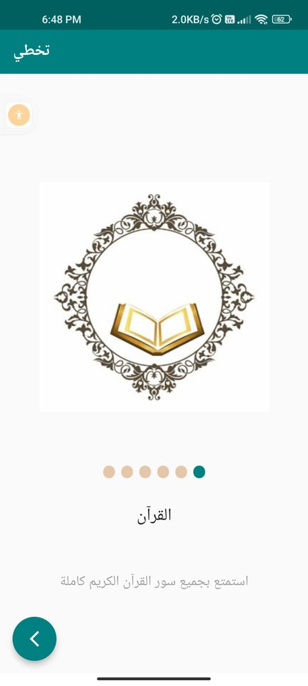
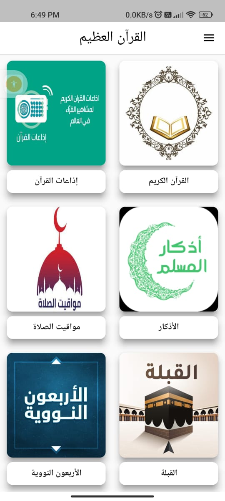
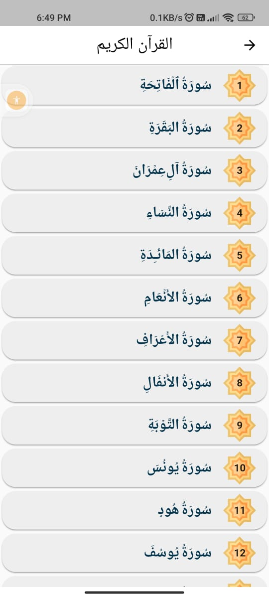
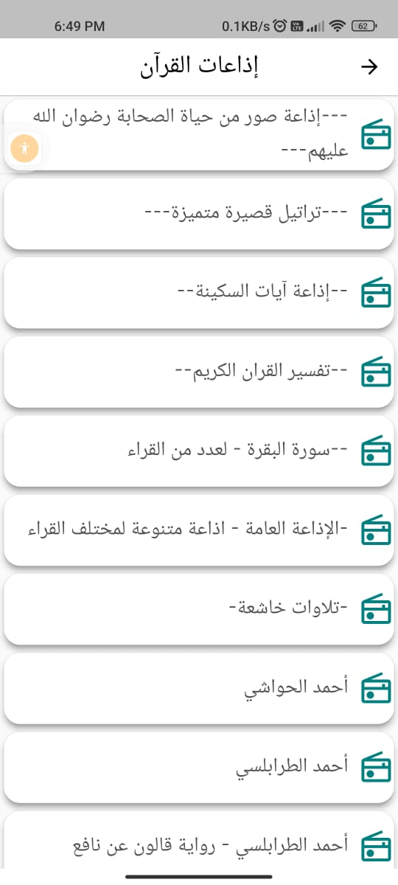
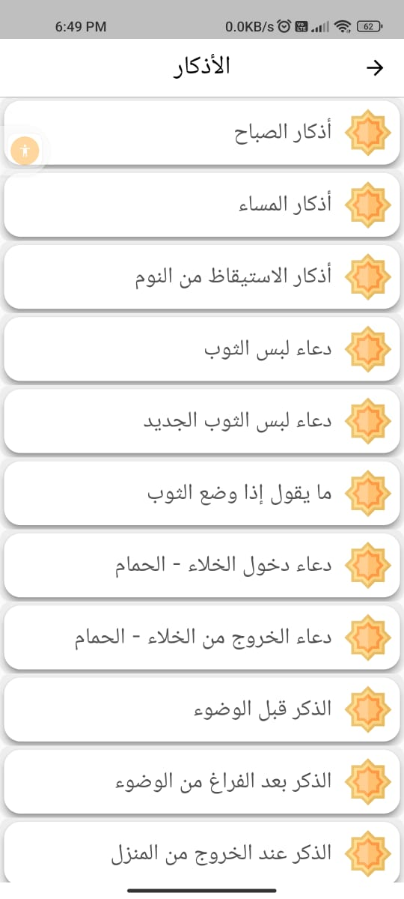
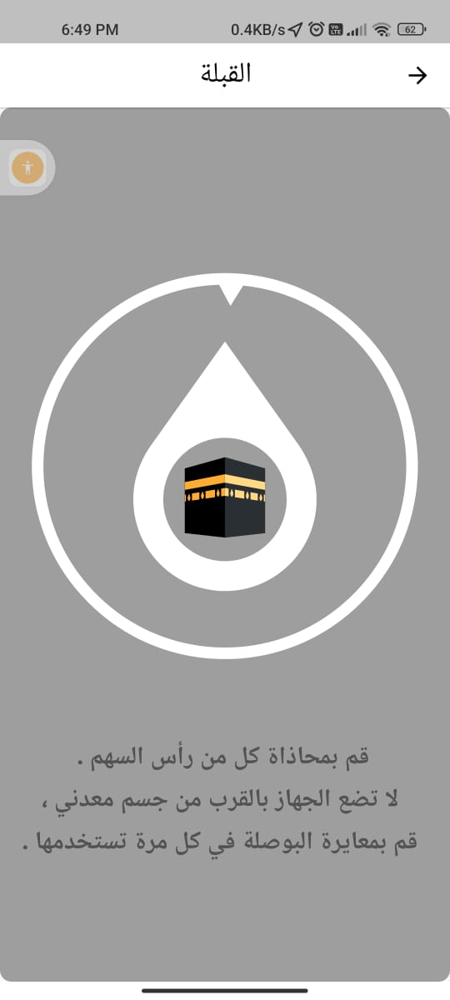
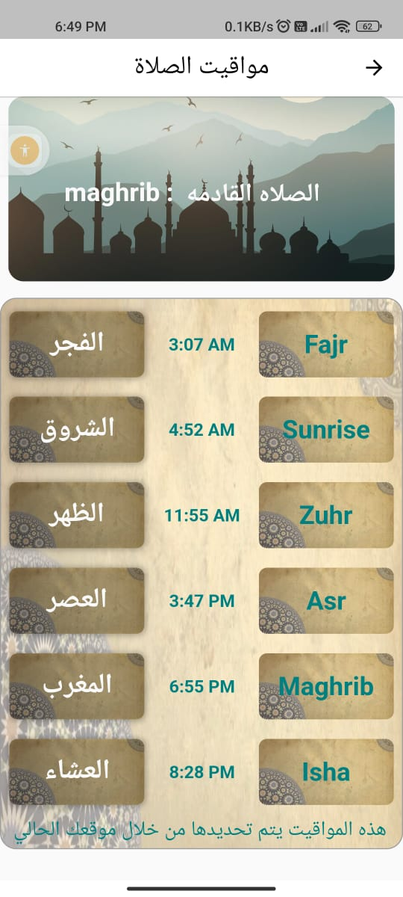
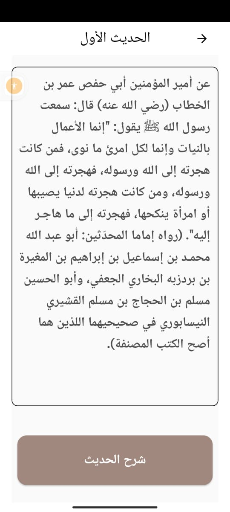

## islamy_app
يحتوي التطبيق علي القرآن الكريم واذاعات القران واذكار الصباح والمساء وبعض الادعية الذي يحتاجها المسلم في حياته وايضا مواقيت الصلاة واتجاه القبلة وكتاب الاربعون النووية

 The application contains the Noble Qur’an, Qur’an radio stations, morning and evening remembrances, and some supplications that a Muslim needs in his life, as well as prayer times, the direction of the qiblah, and the Forty-Nawawi book

 
 Please star ⭐ the repo if you like what you see😉.

</img>
</img>
</img>
</img>
</img>
</img>
</img>
</img>

✨ Plugins and Concepts :
  
apiQuran: http://api.alquran.cloud/v1/quran/quran-uthmani

  
apiRadio: https://www.mp3quran.net/api/radio/radio_ar.json

  
apiAzkar:https://github.com/osamayy/azkar-db/blob/master/azkar.json

  
apiNawawi:https://github.com/osamayy/40-hadith-nawawi-db/blob/main/40-hadith-nawawi.json

  
 ##Package: 
  

. dartz: ^0.10.1

 
. equatable: 

.  flutter_bloc

.  flutter_compass

 
. flutter_localizations:

 
.   http

.  carousel_slider

.  share_plu

.  clipboard

.  audioplayers

.  shared_preferences

.  smooth_page_indicator

.  flutter_launcher_icons

.  intl: 

  
. flutter_qiblah:

.  geolocator: 

.  adhan: 

.  flutter_svg: 

 

 .Bloc: 

